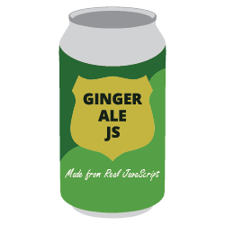

<p align="center">
  
</p>

<h1 align="center">Gingerale</h1>

<p align="center">Gingerale is a simple and easy to use spritesheet to sprites converter with support for uniform spritesheets and texture atlas' with support for tilemaps and texture packing coming soon.<p>

<div align="center">
  <a href="https://badge.fury.io/js/gingerale"></a>
  <a href="https://badge.fury.io/js/gingerale"></a>
  <a href="https://badge.fury.io/js/gingerale"></a>
  <a href="https://badge.fury.io/js/gingerale"></a>
</div>

## **Installation**

To install this module through npm, simply use the following command:

```
$ npm install --save gingerale
```

and to use it, you can import is as an ES6 module:

```js
import * as gingerale from './node_modules/gingerale/gingerale.js';
```

or reference the script:

```html
<script src='./node_modules/gingerale/gingerale.min.js'>
```

## **API**

Gingerale has two main methods supporting the two different types of spritesheets it can parse, `uniform` and `atlas` with a third on the way.

Also, since loading of files such as image files is an asynchronous action, all methods in Gingerale return promises so you can either use `then` or `await` as shown in the examples below.

### **spritesheetToSprites**

The `spritesheetToSprites` method is used to get sprites from a uniform spritesheet. This means that every individual sprite in the provided spritesheet must have the same fixed width and height.

| param  | type   | description                                   | default |
|--------|--------|-----------------------------------------------|---------|
| src    | string | The path to the spritesheet.                  |         |
| width  | number | The width of each sprite in the spritesheet.  |         |
| height | number | The height of each sprite in the spritesheet. |         |


Using `Promise.then`:

```js
// This will take a uniform spritesheet with every sprite in the sheet having a width
// of 32px and a height of 48px.
gingerale.spritesheetToSprites('./path/to/uniform.spritesheet.png', 32, 48).then((sprites) => {

  // Logs an array of the sprites from the uniform spritesheet.
  console.log(sprites);

});

```

Using `async/await`:

```js
async function main() {

  // This will take a uniform spritesheet with every sprite in the sheet having a width
  // of 32px and a height of 48px.
  // You should probably use `try, catch`
  const sprites = gingerale.spritesheetToSprites('./path/to/uniform.spritesheet.png', 32, 48).catch((err) => console.log(err));

  // Logs an array of the sprites from the uniform spritesheet.
  console.log(sprites);

}

main();
```

### **atlasToSprites**

The `atlasToSprites` method takes in a texture atlas image file and then accompanying JSON file which specifies where and what size the sprites are in the image file and returns an array of the individual sprites.

| param | type   | description                                                | default |
|-------|--------|------------------------------------------------------------|---------|
| image | string | The path to the spritesheet.                               |         |
| json  | string | The path to the JSON file that accompanies the spritesheet |         |


Using `Promise.then`:

```js
// This will take a texture atlas spritesheet and JSON file and extract the sprites.
gingerale.atlasToSprites('./path/to/atlas.spritesheet.png', './path/to/atlas.reference.json').then((sprites) => {

  // Logs an array of the sprites from the texture atlas.
  console.log(sprites);

});

```

Using `async/await`:

```js
async function main() {

  // This will take a texture atlas spritesheet and JSON file and extract the sprites.
  // You should probably use `try, catch`
  const sprites = gingerale.atlasToSprites('./path/to/atlas.spritesheet.png', './path/to/atlas.reference.json').catch((err) => console.log(err));

  // Logs an array of the sprites from the texture atlas.
  console.log(sprites);

}

main();
```

## **License**

MIT